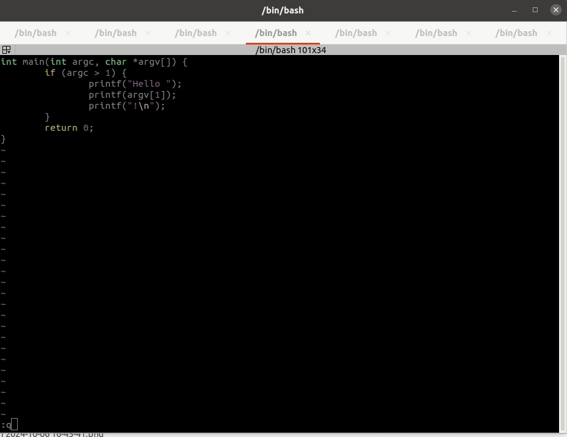

# 0xFFFFE -- Fuzzing Fundamentals For Firmware Engineers

Welcome to **0xFFFFE**, a practical guide and starter toolkit to help embedded developers get started with **fuzzing** -- the art and science of automatically testing your code by throwing unexpected, random, or malformed input at it.

Whether you're writing bare-metal code, working with RTOSes like FreeRTOS or Zephyr, or building embedded Linux systems, fuzzing can help uncover subtle bugs, vulnerabilities, or hard-to-reproduce edge cases.

> **0xFFFFE** = `Fuzzing Fundamentals For Firmware Folks` -- and yes, it's also a very nice address for crashing...

## What is Fuzzing?

Fuzzing is a dynamic testing technique where you feed random or semi-random data into your code to see how it behaves. If your firmware crashes, asserts, leaks memory, or hangs — the fuzzer has done its job.

## Who is this for?

- Embedded developers who **care about robustness and security**
- Firmware engineers who are **new to fuzzing**
- Anyone who wants to **bring fuzzing into CI** for embedded systems
- Engineers working with C, C++, or Rust-based firmware

## What's Inside?

### Projects

Fuzz targets from simple examples for demonstration to real-life application, modules or libraries.

### Tools

Overview of different fuzzers
- Black-box fuzzers
- Grey box fuzzers
    - Coverage guided
    - State guided, protocol fuzzers
    - LLM enhanced
- White box fuzzers

### Methods

- Host tests
- HW in the loop
- QEMU

## Getting started

For concrete examples of specific fuzzing experiments, start with the [`examples`](examples/README.md) directory where you'll find hands-on examples and practical implementations.

