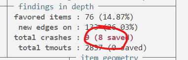
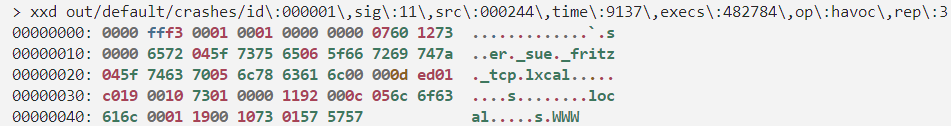
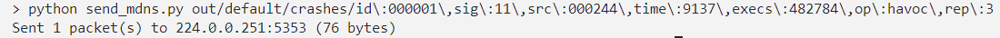
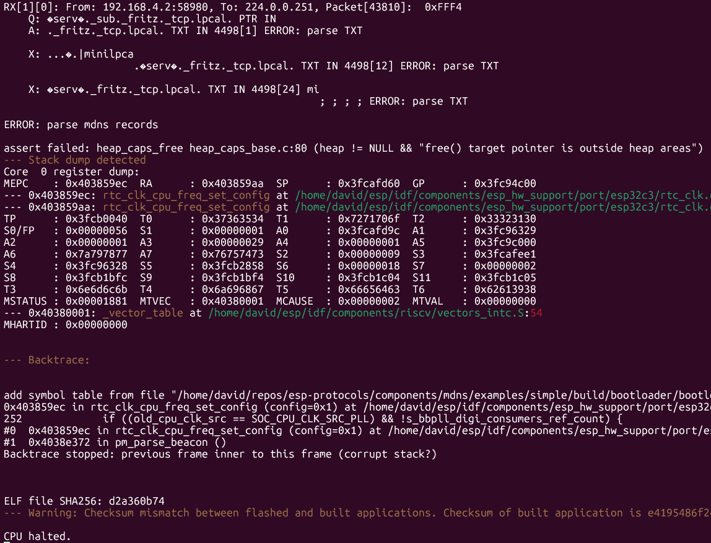
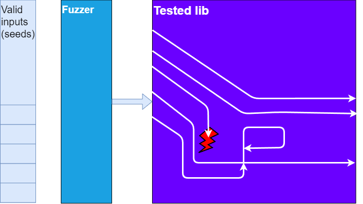
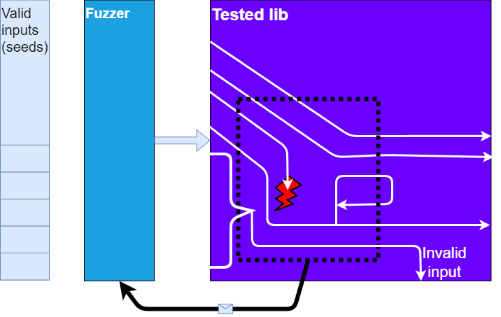
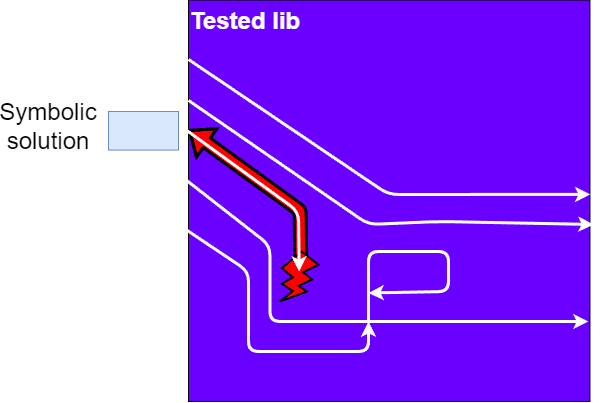

# Practical intro into fuzz-testing


**David Cermak, Embedded developer**

---


# What is Fuzzing?

> **Dynamic testing technique** that feeds random/malformed input to find crashes, vulnerabilities, and edge cases

## Why Should We Care
- **Robustness**: Find subtle bugs before deployment
- **Security**: Discover vulnerabilities in protocol stacks
- **Edge Cases**: Uncover hard-to-reproduce issues
- **CI Integration**: Automated testing for continuous quality

---
## Experiment #1: mDNS library (1/5)

### Fuzz with AFL++

* Production library 👉 [mDNS](https://components.espressif.com/components/espressif/mdns)
* Real bug 👉 Fixed in [8fd2c99f](https://github.com/espressif/esp-protocols/commit/8fd2c99f)
###  Experiment
1) revert the fix, pull `aflplusplus` docker image
2) start fuzzing⚙️
3) convert the crash bins to multicast packets➡️
4) send the packet to local network and observe your device💥

---

#### Experiment #1: Start fuzzing with AFL++ (2/5)


---

### Experiment #1: Conclude fuzzing campaign (3/5)

* Explore crashes (found 8 crashes!)

* Inspect the crash bins


---

### Experiment #1: Construct the packet and send it (4/5)




---

### Experiment #1: Conclusion (5/5)

* Crashes found after ~15 minutes of fuzzing **on host**
* Root-cause: Invalid TXT list processing
* Issue: `free()` of invalid pointer causes the target to reset (by default)
* Periodic send of the **crafted packet** keep all *vulnerable* ESP32's in a local network in **reset loop**

---


## __github.com/david-cermak/0xFFFFE__

### Fuzzing Fundamentals For Firmware Engineers (FFFFE)


* **Projects** (demo apps -> libs)
* **Tools** -- fuzzers
  * Black-box
  * Grey box (Coverage guided, state guided, protocol fuzzers, LLM enhanced)
  * White box fuzzers
* **Methods** (Host tests, HW in the loop, QEMU)

---

## Fuzzing Approaches

### Black-box (radamsa)

### Grey box fuzzers

* Coverage guided (AFL++)
* State guided, protocol fuzzers (AFLNet)
* LLM enhanced

### White box (angr)

---

## Black box
* Mutate inputs and send to the *DUT*



---

## Grey box
* Builds a feedback loop from the actual inputs



---

## White box
* Resolves *vulnerable* inputs from "interesting" points in the *DUT* code


---


# Fuzzing Approaches

| Approach | Tool | Method | Pros | Cons |
|----------|------|--------|------|------|
| **Black-box** | radamsa | Random input mutation | Simple, fast setup | Limited coverage |
| **Grey-box** | AFL++ | Feedback-driven exploration | High effectiveness, finds complex bugs | Requires instrumentation |
| **White-box** | angr | Path analysis without execution | Works on binaries, deep analysis | Limited, research-focused |


---

## Experiment #2: Hello World with radamsa (1/2)

```cpp
printf("Hello ");
printf(argv[1]);  // printf("%s", argv[1]);
printf("!\n");
// $./hello David
// Hello David!
```
Contrived example to demonstrate fuzzing principles
* `warning: format string is not a string literal (potentially insecure)`
* Format injection issue `./hello %s` dereferences *unknown* stack memory
* Doesn't *usually* crash on linux
  * Needs **address sanitizer**!

---
## Experiment #2: Hello World with radamsa (2/2)
1) build with `-fsanitize=address`
2) fuzz on command line: Pipe your inputs to the *fuzzer* and then to your *DUT*

```bash
echo "David @#$^%&" | radamsa -n 1000 | xarg -0 ./hello
#
# 1000 runs, 6 errors found
# AddressSanitizer: SEGV on format string vulnerability
```

- 💡Random inputs ➡️ Use fuzzers to mutate inputs
- 💡Sanitizers ➡️ Address sanitizer caught the issue

---

# Tools and examples in 0xFFFFE repo

|   |   |     |
|-------------------|------|----|
| **00_radamsa_hello**  <br/> 💡 Use sanitizers  | **01_radamsa_sample** |  **02_afl_lwip_dhcp** |
| **03_boofuzz_iotparser** |  **04_boofuzz_mdns** | **05_fuzztest_iotparser** <br/> 💡Property based  <br/> ➡️ Define *correct*|
| **06_angr_firmwarebin** |  **07_afl_lwip** | **08_afl_mdns_gcov** <br/>💡Generate seeds  <br/> ➡️ LLM with gcov |
| **09_aflnet_dhcp_server** | **10_afl_mqtt** | **11_afl_dpcp_server**    |


---

# Property-based testing integration

## Meet **fuzztest**
* Extends fuzzing with **Property based tests**
* Uses standard GTest/GMock

```cpp
TEST(IoTParserTest, FuzzMqttTopicParsing) {
  // Combines:
  //   1) unit tests 
  //   2) property based tests
  //   3) fuzzing
  // 16,984 runs, 192 edges covered
  // Found buffer overflow in 69-byte input
}
```

---

# Firmware Binary with angr
## White-box analysis - Research frontier

```python
# Symbolic execution of firmware binary
# Path analysis without execution
# Limited but powerful for specific cases
```

**Key Takeaways:**
- ✅ **Binary analysis** - no source code needed
- ✅ **Deep exploration** - symbolic path solving
- ⚠️ **Limited scope** - research tool, not production
- ⚠️ **Complex setup** - requires expertise

---

## 📚 **Learn More**

- **0xFFFFE Repository**
   - https://github.com/david-cermak/0xFFFFE
- **AFL++** -- Quick start
   - https://github.com/AFLplusplus/AFLplusplus
- **Fuzztest** -- Property based & unit tests
   - https://github.com/google/fuzztest
- **CI integration** -- 15m fuzzing/week
   - [example with GitHub actions](https://github.com/espressif/esp-protocols/blob/318bca16576f679036f9fb09ecada68f66c102fd/.github/workflows/mdns__host-tests.yml#L97-L110)
---

### 💡Start fuzzing now
&nbsp;&nbsp;&nbsp;&nbsp;&nbsp;&nbsp;  ➡️ Pull __aflplusplus__ docker image
&nbsp;&nbsp;&nbsp;&nbsp;&nbsp;&nbsp;  ➡️ Generate fuzz targets with coding assistants

### 💡Generate input seed

&nbsp;&nbsp;&nbsp;&nbsp;&nbsp;&nbsp; ➡️ Use mutators instead of random inputs
&nbsp;&nbsp;&nbsp;&nbsp;&nbsp;&nbsp; ➡️ Use LLMs, coverage driven

### 💡Next steps
&nbsp;&nbsp;&nbsp;&nbsp;&nbsp;&nbsp; ➡️ Use sanitizers (asan, ubsan, ...)
&nbsp;&nbsp;&nbsp;&nbsp;&nbsp;&nbsp; ➡️ Add fuzzing to CI  10m ~ 1h, weekend runs
&nbsp;&nbsp;&nbsp;&nbsp;&nbsp;&nbsp; ➡️ Integrate with unit/property based tests
