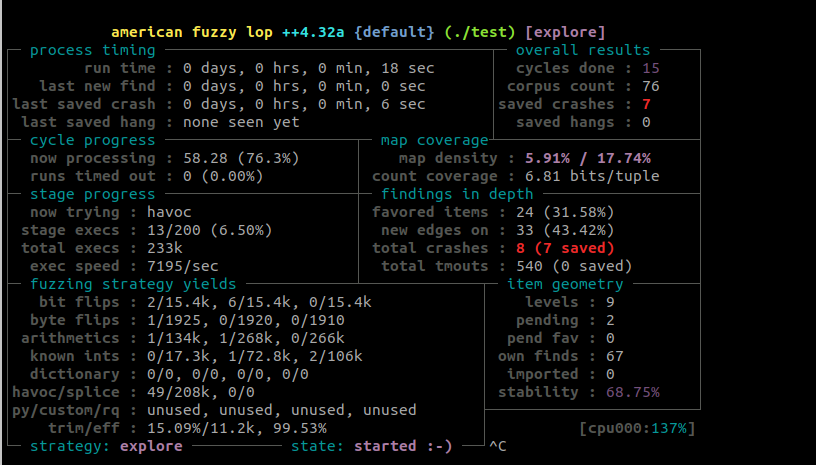

# Install dependencies:
```
$ ./setup_deps.sh
```

# Start AFL++ in a container

```
$ podman run -it -v $(pwd):/mnt aflplusplus bash
```

# Start fuzzing

go to the lwip/afl test directory and start fuzzing

```
$ cd /mnt/idf/components/lwip/test_afl_host
$ make fuzz MODE=dhcp_client
```

After some time you'll find the crash(es)



# Go to the crashes directory to reproduce the bug

Could be on your host machine (no need for AFL compiler here)
* Move inputs from the crash directory to the AFL dir, e.g.
* Compile with standard GCC (no instrumentation)
* run and feed it with the crash file
```
$ mv out/default/crashes/id\:000001\,sig\:06\,src\:000058\,time\:2829\,execs\:108818\,op\:havoc\,rep\:4 crash.2
$ make MODE=dhcp_client INSTR=off
$ ./test_sim crash.2
Aborted (core dumped)
```

Debug and fix the bug
